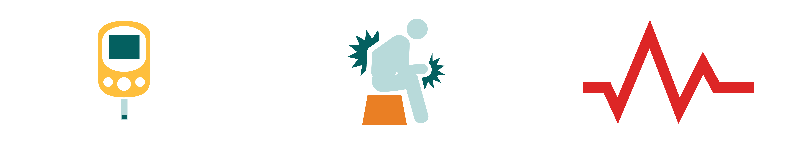
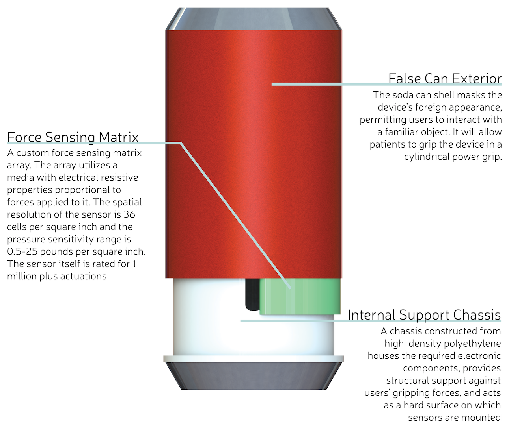
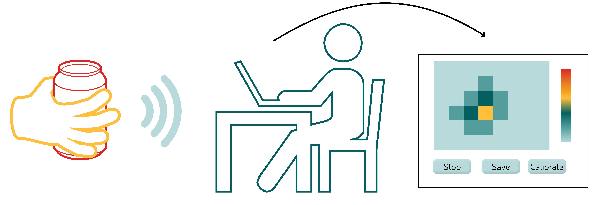
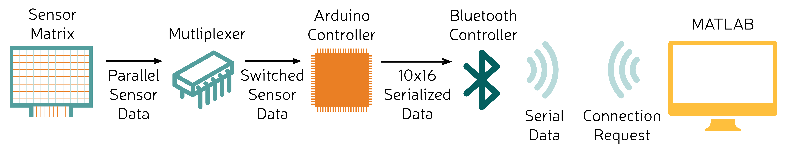
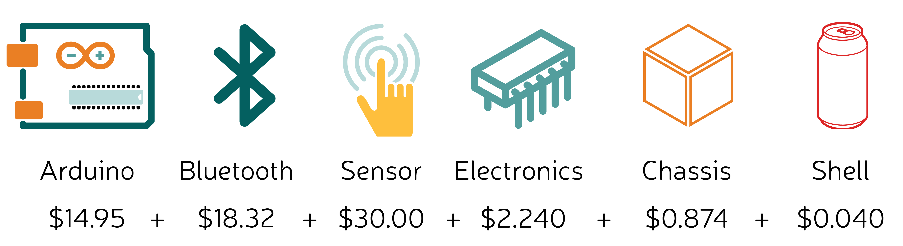

###Background

From the fall semester, in summary, we learned that:

Grip force measurements from current devices, such as hand-held dynamometers, are poorly correlated with patients’ gripping performance during functional tasks, e.g. grabbing a can of soda. These devices are unfamiliar to patients, can’t measure the five major types of grip, and lack the diagnostic resolution of a force distribution. Therefore, Improved assessment of patients’ gripping ability is necessary to identify the efficacy of treatments for grip-related disabilities.

This translates well into the current market:

    

        
    

    

        
25.8 million Americans with diabetes, 60 to 70% of which have nervous system damage

    

    

        
50.0 million Americans suffer from arthritis, a number that is expected to increase to 67.0 million by 2030

    

    

        
7.0 million stroke survivors in America, 40% of which experience moderate to severe impairments

    

<h3 data-magellan-destination="device">The Device</h3>

    

        
    

    

    

<h3 data-magellan-destination="software">Software Interface</h3>

    

        
    

<h3 data-magellan-destination="signal">Signal Pathway</h3>

    

        
    

<h3 data-magellan-destination="production">Production</h3>

    

        
    

