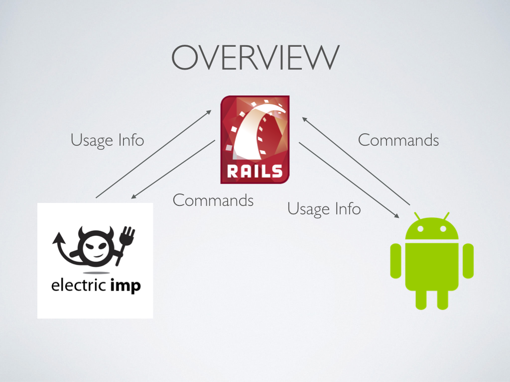
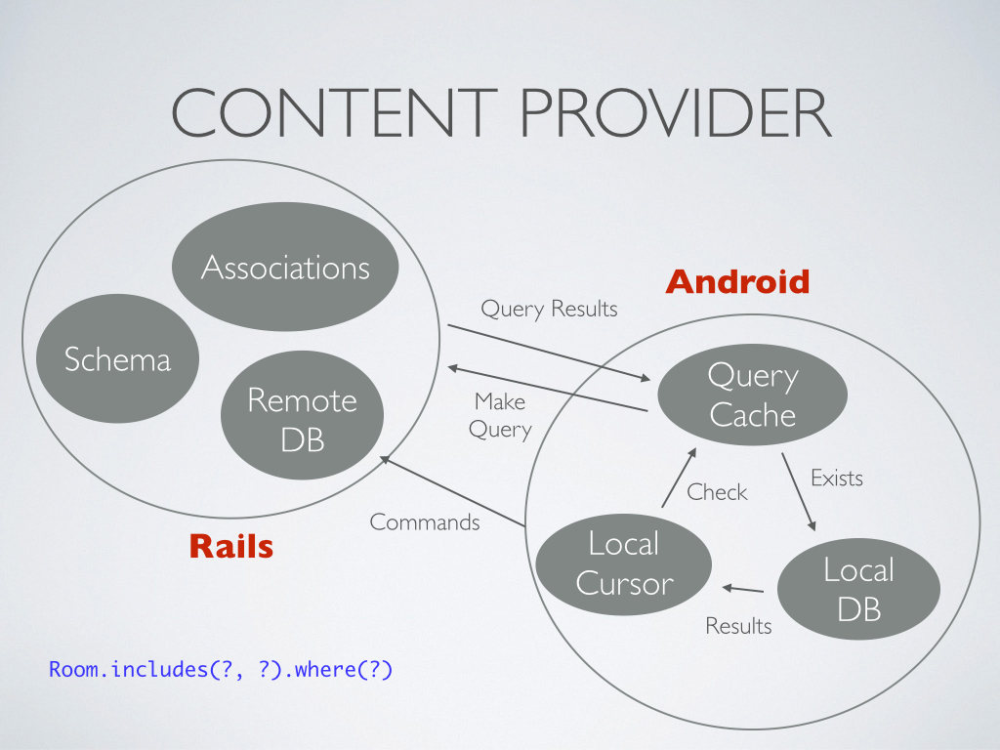
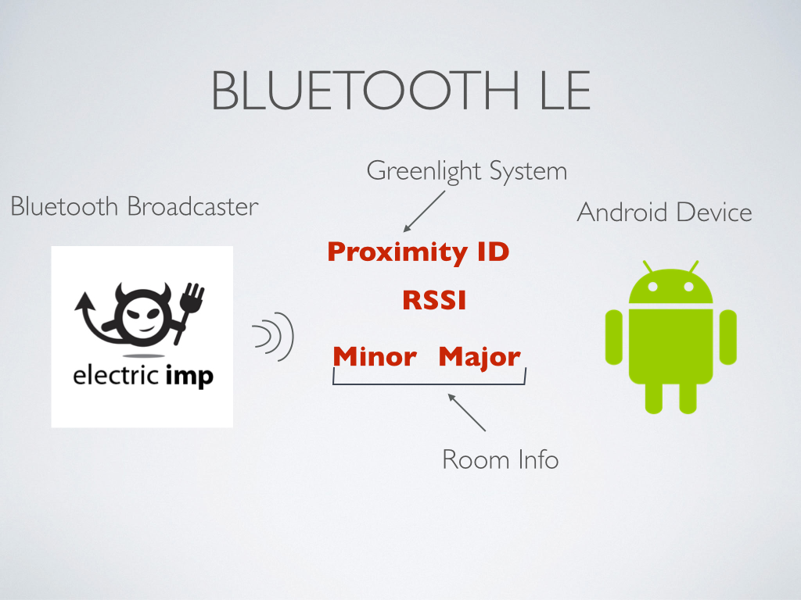

### Overview

[Greenlight][3] is a daylight harvesting system my Information Systems team created (you can read more about it by following the link). The Android application I created is an extension of this -- it allows you to view any information you normally see through the web application on your phone. It does this by connecting to our Ruby on Rails server through an API I created to pair with the Android application. After using a token for authentication, users can view information about a room, including power consumption and sensor graphs, as well as control the room's lights. As an extra feature, the application can detect with a user is in a room by using a Bluetooth LE beacon. 

### Architecture

The app utilizes two core components of the Android framework to manage its connection to the Ruby on Rails application. For authentication, Android's AbstactAccountAuthenticator class was implemented to allow for a more structured authentication process. This allows a user's
[Greenlight][3] account to appear in the general settings screen, and allow for background Bluetooth scanning preferences to be adjusted. 

For actually transmitting and receiving data, a custom content provider and cursor were implemented. The content provider utilizes a local caching SQLite database to reduce requests to the database. The content provider accepts rails-esque queries - so you can send, for example: 

`where('id = 5').order_by(:updated_at)`

Additionally the content provider allows you to follow rails associations, so most of the requeries are done for you. 

### Proximity Sensor

The proximity detection portion of the application was created using a Bluetooth LE beacon. I used the [ReadBearLabs BLE Mini][1] and flashed a custom firmware image onto it. The firmware image implemented the Apple iBeacon protocol. This has 4 parts to it: 

* A Proximity ID - used to identify the [Greenlight][3] Beacon
* Major Version - used to identify the room
* Minor Version - used to identify the dimmer in the room
* RSSI - the signal strength information

The Android application uses the [RadiusNetworks iBeacon library][2] to scan for the iBeacon. On bootup of the phone, a background service is started that attaches to the library and scans for broadcasts in the background. Once a broadcast is received, the phone creates a notification, informing the user that a greenlight system is nearby, and when selected, takes them to the appropriate room screen within the application.

On average, the background scanning only reduced battery life by about 1 hour, and it is expected to improve with time. The low energy scanning implemented in Android is, at this point, only supposed to happen at discrete times, rather than constantly, however this constant scanning should hopefully become core in the future. 

[1]: http://redbearlab.com/blemini/
[2]: http://developer.radiusnetworks.com/ibeacon/android/
[3]: /portfolio/greenlight.html